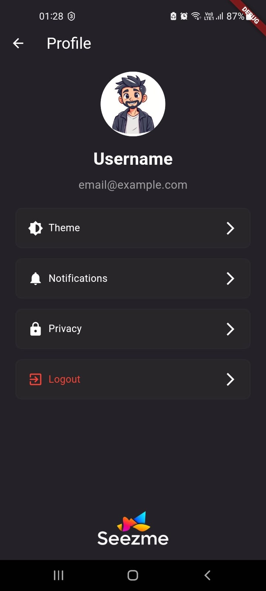
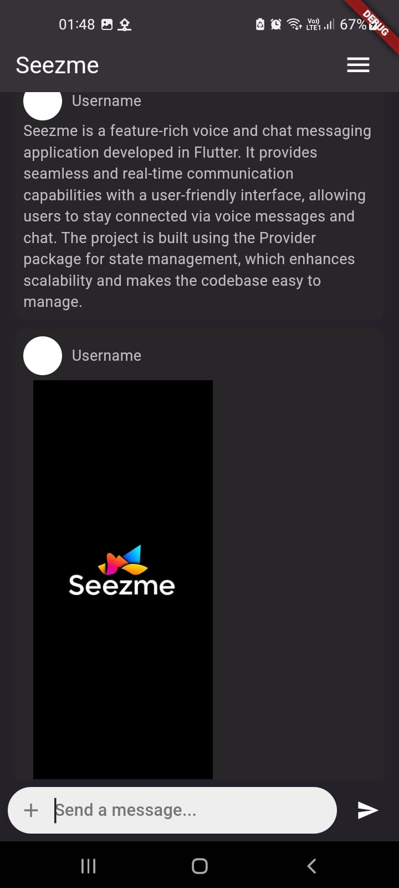
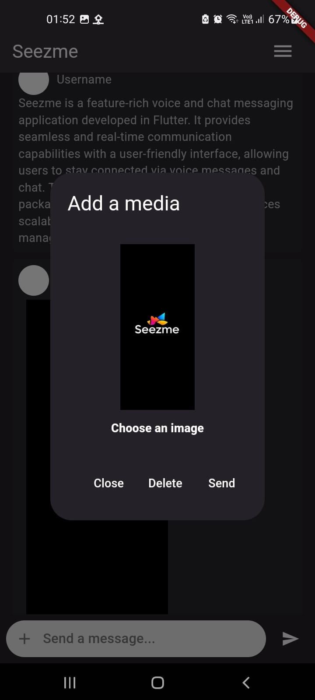
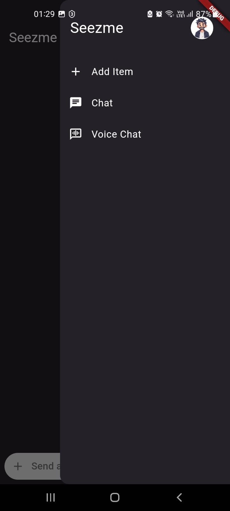

# Seezme - Voice and Chat App

Seezme is a feature-rich voice and chat messaging application developed in Flutter. It provides seamless and real-time communication capabilities with a user-friendly interface, allowing users to stay connected via voice messages and chat. The project is built using the Provider package for state management, which enhances scalability and makes the codebase easy to manage.

## Features

### ✉️ Real-Time Messaging

- **Instant Messaging**: Send and receive text messages in real-time, enhancing user communication experience.
- **Rich Text Support**: Supports multimedia messages, including emojis, images, and audio clips.

### 🧑‍🤝‍🧑 Group Chat

- **Create and Manage Group Chats**: Users can create group chats, or voice chat, adding multiple contacts to a single conversation.

### 🛠 Built with Provider for State Management

- **Provider for Dependency Management**: Utilizes the Provider package for efficient state management across the app.
- **Scalable Architecture**: Separates UI from business logic, making the codebase maintainable and easy to extend.
- **Reactivity**: Automatically updates UI components when there are changes in app data, creating a responsive user experience.

### 🔒 Security

- **Authentication**: Users can sign up and log in securely, with their personal information protected.

### 📱 Platform Compatibility

- **Responsive Design**: Adapts to various screen sizes and orientations to ensure a consistent user experience.

## Gallery

<table>
  <tr>
      <td></td>
      <td></td>
      <td></td>
  </tr>
  <tr>
      <td></td>
      <td></td>
  </tr>
</table>

## Installation

1. Clone the repository:

   ```bash
   git clone https://github.com/ibrahimsezer/seezme.git
   cd seezme
   ```

2. Install dependencies:

   ```bash
   flutter pub get
   ```

3. Run the app:

   ```bash
   flutter run
   ```

## Getting Started with Provider

Seezme uses the [Provider](https://pub.dev/packages/provider) package for state management. Provider simplifies managing state across the application and provides a clear separation of concerns between the UI and business logic. This approach allows for scalability and easier maintenance.

### Key Concepts with Provider

- **Providers**: Manage app-wide states, such as user authentication, message list updates, and chat room management.
- **Consumers**: Widgets that reactively update based on changes in the state, ensuring efficient UI rendering and a smooth user experience.

## Contribution

Contributions are welcome! Please follow these steps to contribute:

1. Fork the repository.
2. Create a new branch:

   ```bash
   git checkout -b feature/YourFeatureName
   ```

3. Make your changes and commit them:

   ```bash
   git commit -m "Add your message here"
   ```

4. Push to the branch:

   ```bash
   git push origin feature/YourFeatureName
   ```

5. Open a pull request.

## License

This project is licensed under the MIT License. See the [LICENSE](LICENSE) file for more details.

---

## Support and Contact

### 📧 Mail : <ibrahimsezer.ceng@gmail.com>

### 🪪 Linkedin : <https://www.linkedin.com/in/ibrahim-sezer>

### 🤵 Portfolio : <https://ibrahimsezer.github.io>
