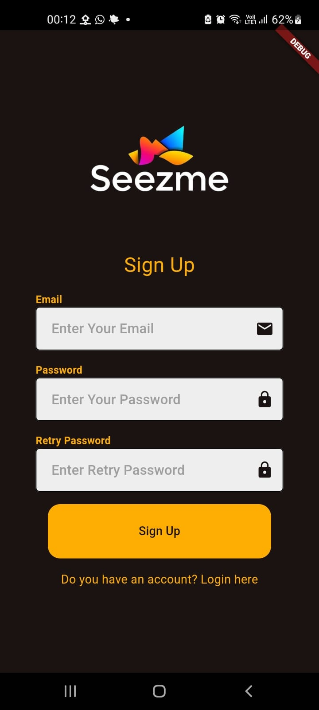
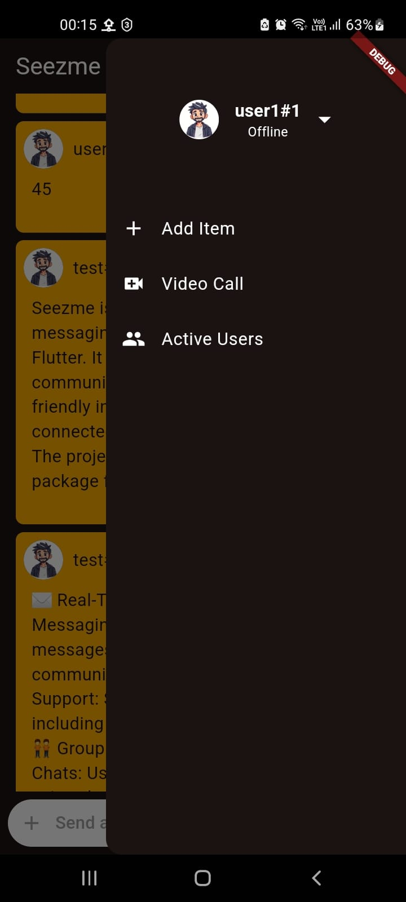
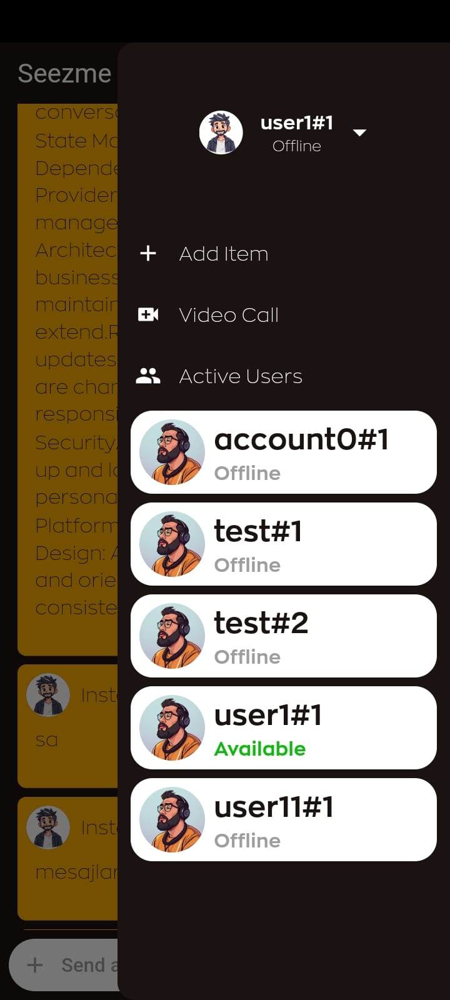

# Seezme - Voice and Chat App

Seezme is a feature-rich voice and chat messaging application developed in Flutter. It provides seamless and real-time communication capabilities with a user-friendly interface, allowing users to stay connected via voice messages and chat. The project is built using the Provider package for state management, which enhances scalability and makes the codebase easy to manage.

## Features

### ✉️ Real-Time Messaging

- **Instant Messaging**: Send and receive text messages in real-time, enhancing user communication experience.
- **Rich Text Support**: Supports multimedia messages, including emojis, images, and audio clips.

### 🧑‍🤝‍🧑 Group Chat

- **Create and Manage Group Chats**: Users can create group chats, or voice chat, adding multiple contacts to a single conversation.

### 🛠 Built with Provider for State Management

- **Provider for Dependency Management**: Utilizes the Provider package for efficient state management across the app.
- **Scalable Architecture**: Separates UI from business logic, making the codebase maintainable and easy to extend.
- **Reactivity**: Automatically updates UI components when there are changes in app data, creating a responsive user experience.

### 🔒 Security

- **Authentication**: Users can sign up and log in securely, with their personal information protected.

### 📱 Platform Compatibility

- **Responsive Design**: Adapts to various screen sizes and orientations to ensure a consistent user experience.

## Gallery

<table>
  <tr>
      <td></td>
      <td></td>
      <td></td>
  </tr>
  <tr>
      <td></td>
      <td></td>
      <td></td>
  </tr>
  <tr><td></td>
      <td></td></tr>
</table>

## Installation

1. Clone the repository:

   ```bash
   git clone https://github.com/ibrahimsezer/seezme.git
   cd seezme
   ```

2. Install dependencies:

   ```bash
   flutter pub get
   ```

3. Run the app:

   ```bash
   flutter run
   ```

## Getting Started with Provider

Seezme uses the [Provider](https://pub.dev/packages/provider) package for state management. Provider simplifies managing state across the application and provides a clear separation of concerns between the UI and business logic. This approach allows for scalability and easier maintenance.

### Key Concepts with Provider

- **Providers**: Manage app-wide states, such as user authentication, message list updates, and chat room management.
- **Consumers**: Widgets that reactively update based on changes in the state, ensuring efficient UI rendering and a smooth user experience.

## Firebase Backend Integration

Seezme leverages **Firebase Firestore** and **Firebase Authentication** to provide a robust backend infrastructure for real-time messaging and secure user authentication. Below is an overview of how Firebase services are integrated into the application.

### **Features**

- **Firebase Authentication**: 
  - User registration and login.
  - Secure authentication via email and password.
  - Easy-to-manage user sessions.
  
- **Firebase Firestore**: 
  - Real-time database for storing user data, chat messages, and status updates.
  - Scalable and flexible document-based structure.
  - Real-time updates to ensure instant communication.

---

### **Firebase Setup Guide**

To set up Firebase for the Seezme project, follow these steps:

1. **Create a Firebase Project**:
   - Go to the [Firebase Console](https://console.firebase.google.com/).
   - Click on **Add Project** and follow the setup wizard.

2. **Enable Authentication**:
   - Navigate to **Authentication** > **Sign-in method**.
   - Enable **Email/Password** authentication.

3. **Setup Firestore**:
   - Navigate to **Firestore Database** > **Create Database**.
   - Select **Start in test mode** (or configure rules based on your needs).
   - Create the following collections:
     - `users`: Stores user profiles (e.g., email, username, status).
     - `messages`: Stores chat messages (e.g., sender ID, receiver ID, timestamp, message content).

4. **Download Firebase Config File**:
   - For Android: Download `google-services.json` and place it in the `android/app` directory.
   - For iOS: Download `GoogleService-Info.plist` and add it to your iOS project.

5. **Add Dependencies**:
   Ensure the following dependencies are added to your `pubspec.yaml` file:
   ```yaml
   dependencies:
     firebase_core: ^2.0.0
     firebase_auth: ^5.0.0
     cloud_firestore: ^4.0.0
     provider: ^6.1.0
   ```

6. **Initialize Firebase**:
   Add Firebase initialization code in your main file:
   ```dart
   import 'package:firebase_core/firebase_core.dart';

   void main() async {
     WidgetsFlutterBinding.ensureInitialized();
     await Firebase.initializeApp();
     runApp(SeezmeApp());
   }
   ```

---

### **Firestore Data Structure**

Below is a suggested structure for your Firestore database:

#### **Users Collection**
| Field       | Type       | Description                     |
|-------------|------------|---------------------------------|
| `uid`       | String     | Unique user ID.                |
| `email`     | String     | User's email address.          |
| `username`  | String     | User's display name.           |
| `status`    | String     | Online status (available, busy, offline). |
| `createdAt` | Timestamp  | Account creation date.         |

#### **Messages Collection**
| Field       | Type       | Description                     |
|-------------|------------|---------------------------------|
| `senderId`  | String     | UID of the message sender.     |
| `receiverId`| String     | UID of the message receiver.   |
| `content`   | String     | Message content.               |
| `timestamp` | Timestamp  | Time the message was sent.     |

---


## Contribution

Contributions are welcome! Please follow these steps to contribute:

1. Fork the repository.
2. Create a new branch:

   ```bash
   git checkout -b feature/YourFeatureName
   ```

3. Make your changes and commit them:

   ```bash
   git commit -m "Add your message here"
   ```

4. Push to the branch:

   ```bash
   git push origin feature/YourFeatureName
   ```

5. Open a pull request.

## License

This project is licensed under the MIT License. See the [LICENSE](LICENSE) file for more details.

---

## Support and Contact

### 📧 Mail : <ibrahimsezer.ceng@gmail.com>

### 🪪 Linkedin : <https://www.linkedin.com/in/ibrahim-sezer>

### 🤵 Portfolio : <https://ibrahimsezer.github.io>
